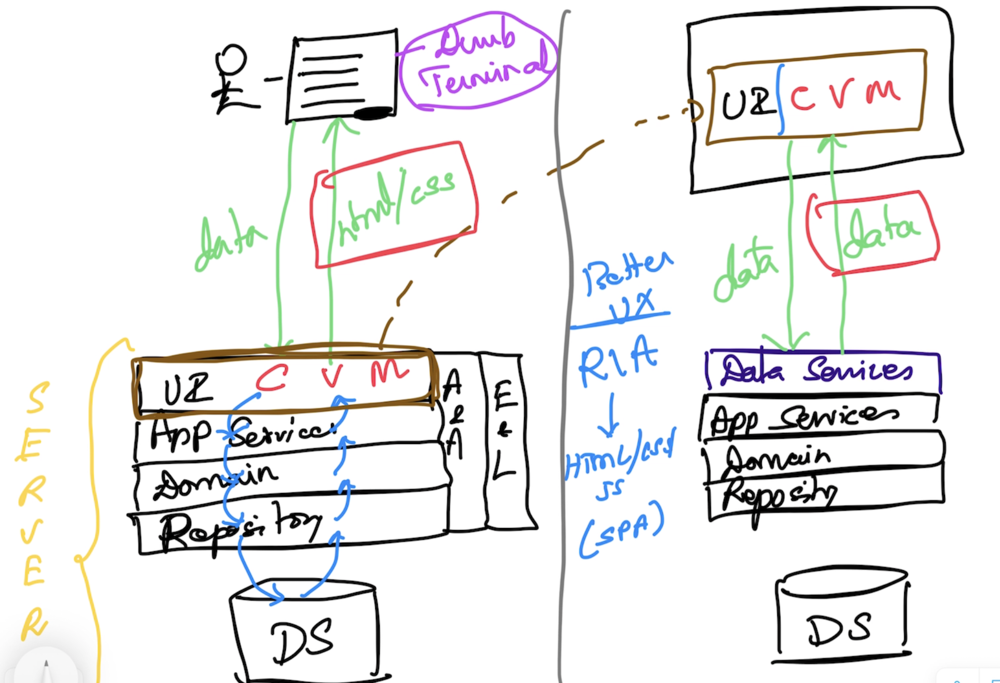
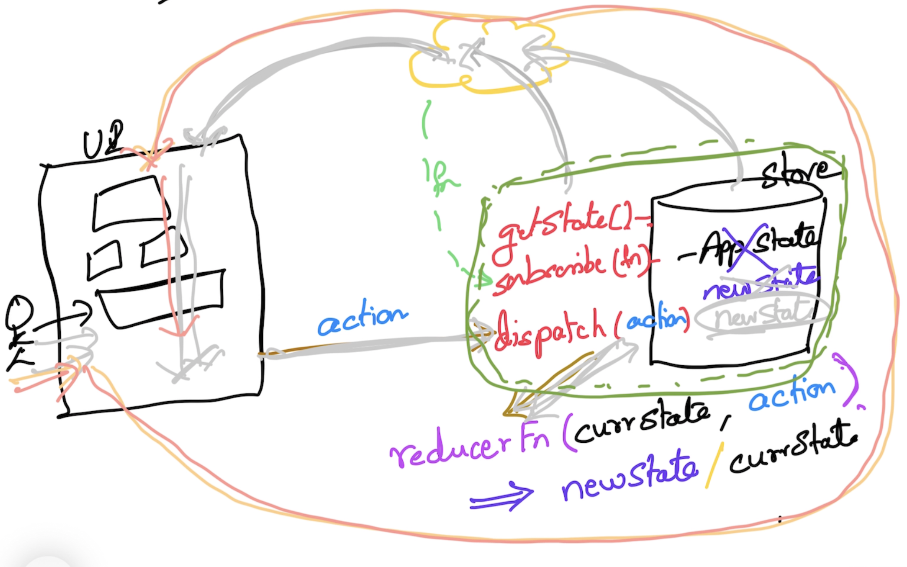

# React.js & Redux

## Magesh Kuppan
- tkmagesh77@gmail.com

## Schedule
- Commence      : 09:30 AM 
- Tea Break     : 11:00 AM (15 mins)
- Lunch Break   : 01:00 PM (1 hour)
- Tea Break     : 3:30 PM (15 mins)
- Wind up       : 5:30 PM

## Methodology
- No powerpoint
- Discussion & Code

## Repository
- https://github.com/tkmagesh/sincro-react-jul-2024

## Software Requirements
- Node.js
- Chrome Browser
- Visual Studio Code (or any other editor)

## Pre-requisites
- Experience in JS (including ES6)

## CWA (Classical Web Apps) vs RIA (Rich Internet Apps)



## Why React.js?
- Rich Internet Applications


## JSX vs HTML
### JSX
- Every element has to have the corresponding close element
- Use "htmlFor" in place of "for" attribute
- Use "className" in place of "class" attribute

## View
- Presentation (VDOM (JSX)) + UI Behaviour + UI State = Component

## Component
- a function that returns VDOM
- component function names must start with uppercase

## Hooks 
- functions with name 'use'

## State
### Application State
- Data that supports the 'domain' logic of our application
- It is highly LIKELY that a change in this data need to recognized and acted up on by other parts of the application as well
- DO NOT maintain this in the component (using useState())
### UI State
- Data that supports the 'presentation' needs of the 'component'
- It is highly UNLIKELY that a change in this data need to be recognized by other parts of the application
- Feel free to maintain this in the component itself

## State Manager


## Component Types
### Container/Smart Component
- Responsible for organizing the data (from the store) & action dispatchers and pass them to the presentation components
- DO NOT have any user interaction responsibility
### Presentation/Dumb Component
- Receive the data from the Container component and present it to the user
- Receive the action dispatchers from the container component and dispatch the actions based on user interaction
- DO NOT interact with the store

## Day-3 Homework
1. clone the bug-tracker-app from github
2. implement the 'projects' module with only add & list functionality
    project = { id, name }
    
    comment out the 'bugs' related code in the following files and add new code for 'projects'
        src/store/index.js
        src/index.js
    

## Middleware
- Any logic that is common across actions

### Function Composition and Chaining
```js
function add(x ,y){
    console.log('Add Result', x + y);
}

function logWrapper(next){
    return function(x,y){
        console.log(`[logWrapper] processing ${x} and ${y}`);
        next(x,y);
    }
}

function profileWrapper(next){
    return function(x,y){
        console.log(`[profileWrapper] profiling started`);
        let start = new Date();
        next(x,y);
        let elapsed = (new Date()) - start;
        console.log(`[profileWrapper] elapsed ${elapsed}`);
    }
}

add = profileWrapper(logWrapper(add))
add(100,200)
```

## Async Programming in JS
### Async Operation
    - An operation that will complete sometime in future 
    - An operation that is not 'waited' for its completion

## Axios Usage
```js
axios.get('http://localhost:3030/projects')
    .then(response => response.data)
    .then(projects => console.table(projects))

// using async await
const response = await axios.get('http://localhost:3030/projects')
const projects = response.data
console.table(projects)

// POST
const newProjectData = { id : 0, name : 'Expense Manager' }
const response = await axios.post('http://localhost:3030/projects', newProjectData)
const newProject = response.data
console.log(newProject)
```

